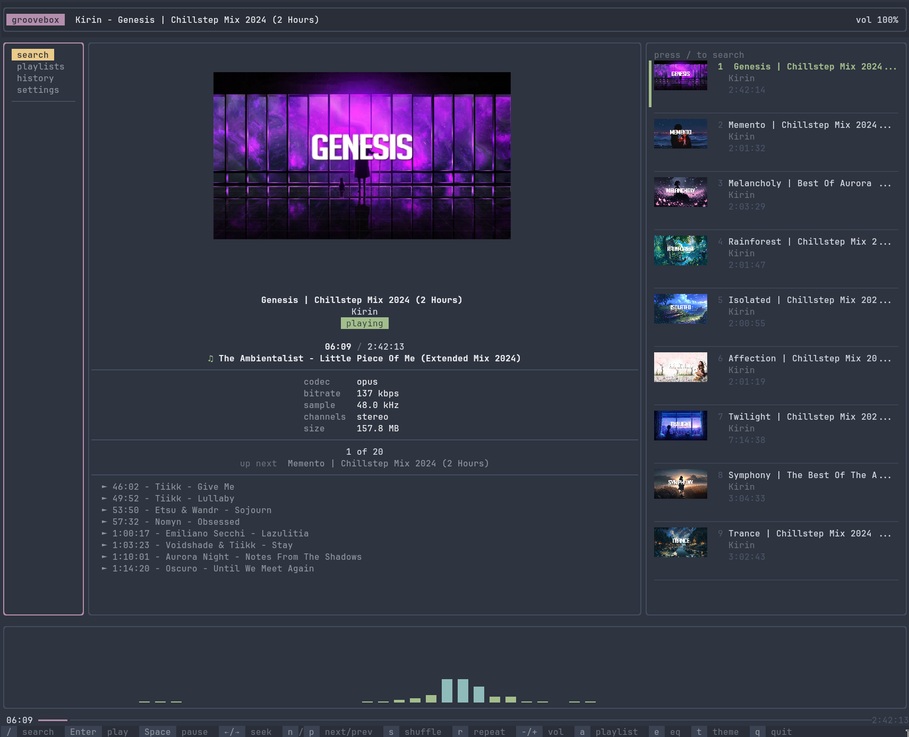

# groovebox

A terminal-based YouTube audio player built in Rust. Search, build playlists, and listen from your terminal with album art, spectrum visualizers, and chapter support.



## Features

**Audio**
- Stream audio directly from YouTube, nothing saved to disk
- Volume control, seek with acceleration, pause/resume
- Shuffle and repeat modes (off, one, all)
- Auto-plays related tracks when the queue runs out
- Session restore picks up where you left off on restart

**Discovery**
- YouTube search from the terminal
- Play history with timestamps
- Custom playlists with add/remove
- Chapter detection from video descriptions (timestamps like `0:00 Intro`)
- Smart recommendations based on what you're listening to

**Visuals**
- Album art thumbnails rendered directly in the terminal (Kitty, Sixel, iTerm2, or text fallback)
- 12 real-time spectrum visualizer styles
- 5 color themes: Catppuccin Mocha, Tokyo Night, Dracula, Gruvbox Dark, Nord
- Responsive layout that adapts to terminal size
- Now-playing panel with track info and audio metadata

## Install

### Prerequisites

**Required (must be on your PATH):**

| Program | Min Version | Install |
|---------|-------------|---------|
| [yt-dlp](https://github.com/yt-dlp/yt-dlp) | 2024.01+ | `pip install yt-dlp` |
| [mpv](https://mpv.io/) | 0.37+ | `sudo apt install mpv` / `brew install mpv` |
| [ffmpeg](https://ffmpeg.org/) | 6.0+ | `sudo apt install ffmpeg` / `brew install ffmpeg` |

groovebox checks for these on startup and tells you what's missing.

**Build dependencies (Linux):**

```sh
# Debian / Ubuntu
sudo apt install libasound2-dev libpipewire-0.3-dev

# Fedora
sudo dnf install alsa-lib-devel pipewire-devel

# Arch
sudo pacman -S alsa-lib pipewire
```

macOS needs no additional build dependencies.

**Rust 1.75+ required** (install via [rustup.rs](https://rustup.rs)).

**Optional:**
- **PipeWire** (or PulseAudio) for the spectrum visualizer — most modern Linux desktops ship PipeWire by default
- **A terminal with image protocol support** for album art thumbnails (Kitty, WezTerm, iTerm2, foot, etc.)

### Install from crates.io

```sh
cargo install groovebox
```

### Build from source

```sh
git clone https://github.com/babinc/groovebox.git
cd groovebox
cargo build --release
./target/release/groovebox
```

## Keyboard Shortcuts

### Global

| Key | Action |
|-----|--------|
| `q` / `Ctrl+C` | Quit |
| `Tab` | Cycle focus: navigation > content > queue |
| `Shift+Tab` | Cycle focus backward |
| `/` | Open search |
| `Space` | Play / pause |
| `n` | Next track |
| `p` | Previous track |
| `+` / `-` | Volume up / down |
| `s` | Toggle shuffle |
| `r` | Cycle repeat (off > one > all) |
| `t` | Cycle color theme |
| `e` | Cycle EQ visualizer style |

### Navigation & Lists

| Key | Action |
|-----|--------|
| `j` / `Down` | Move down |
| `k` / `Up` | Move up |
| `Enter` | Select / play track |
| `Left` / `Right` | Seek backward / forward (accelerates with repeated presses) |
| `a` | Add current track to playlist |

### Search

| Key | Action |
|-----|--------|
| Type | Enter search query |
| `Enter` | Execute search |
| `Backspace` | Delete character |
| `Esc` | Cancel search |

## Visualizer Styles

Cycle through 12 styles with `e`:

Bars, Bars Spread, Blocks, Blocks Spread, Peaks, Peaks Spread, Mirror, Mirror Spread, Wave, Wave Spread, Haze, Haze Spread

## Data

All data is stored locally on your machine.

| What | Where |
|------|-------|
| Database (playlists, history) | `~/.local/share/groovebox/groovebox.db` |
| Thumbnail cache | `~/.cache/groovebox/thumbs/` |

## License

MIT
